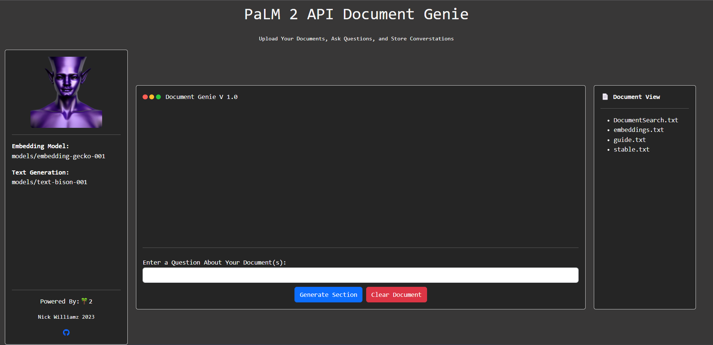

# Palm2DocGenie_WebUI
Generative AI Document Genie is a Flask application built on top of Google's new PaLM 2 generative AI API. 
=======
# Generative AI Document Genie :genie:

Generative AI Document Genie is a Flask application built on top of Google's new PaLM 2 generative AI API. Simply upload your documents you wish to interact with to the `/documents` directory and you're ready to rock! The conversations are stored in `conversation.txt`. To clear the `conversation.txt` file, simply tap the clear button on the front-end UI. If you've added new documents to the `/documents` folder, be sure to refresh your browser page to see the updated files that have been uploaded. 



:rocket: In its current version, the application harnesses the power of the Embedding API and the Generate Text functions which work together to let you upload documents and interact with them via one of Google's Generative Text models. Note that running this application requires access to a Google Generative PaLM 2 API Key, which currently has a waitlist. (Link in Step 1 below)

⚠️ Note: Running this application requires access to a Google Generative PaLM 2 API Key, which currently has a waiting list.

## :key: Prerequisites

Before you get started with Generative AI Document Genie, ensure you have the following:

`Google Generative PaLM 2 API Key`:
   The Palm 2 API_KEYS at the time of writing still require getting on the waitlist which you can access [here](https://developers.generativeai.google/).

`Enable the PaLM API in a new Google Cloud Console project`:
   After obtaining the API key, ensure to enable the PaLM API for your new project.

`Create a new service account key in JSON format for the project`:
   This is a crucial step for the authentication of your project.

`Download the JSON key file and save it securely`:
   This key will be required when setting up the application.

`Conda environment (tested using Python 3.10.10)`:
   Ensure you have a Conda environment setup and ready to go.

## Features

🌐 **Interactive Browser Window Interface:**  
Experience a seamless and engaging interaction with the AI models right in your browser.

🤖 **Integration with PaLM Models for Text Generation:**  
Harness the power of Google's new PaLM models to generate and interact with text content.

📁 **File Loading Functionality to Enhance Content Generation:**  
Upload documents and enrich your content generation journey.

💾 **Easily Save and Clear Your Conversations:**  
Manage your conversations effectively with the option to save and clear them with ease.

👀 **View Models Being Used:**  
Stay informed with the transparency of knowing which model is being used each time you make a call to the API.

👌 **Simple and Intuitive User Interface:**  
Easy to navigate, our user interface ensures that you focus on generating content and not struggling with complex controls.

## Technologies Used

- HTML
- CSS (Bootstrap framework)
- JavaScript (jQuery library)
- Python (PaLM models)
- Flask (Python web framework)


## ⚡ Update (5/21/23) Improved Document Search and Output via ChromaDB

I've recently updated the embedding functionality in our application from using numpy to ChromaDB. This change has resulted in significant improvements in both query time and response quality. The following are the key benefits of this update:

1. **Faster Query Time**: ChromaDB is designed for efficient nearest neighbor search, which allows us to find the most relevant passages more quickly compared to the previous numpy-based implementation. This results in a faster and more responsive user experience.

2. **Improved Response Quality**: ChromaDB's advanced search capabilities enable us to find more relevant passages for the user's query. This leads to higher quality responses generated by the AI model, providing users with more accurate and helpful information.

3. **Scalability**: ChromaDB is built to handle large-scale datasets, making it an ideal choice for our application as the number of documents and embeddings grows. This ensures that our application can continue to provide fast and accurate results as the dataset expands.

4. I've added a Cosign similarity value for each of the queries generated on the front end at the end of the text.

## Getting Started

To get started with the Generative Markdown Genie app, follow these steps:

1. Clone the repository:
```
   git clone https://github.com/Nick-Williamz/Palm-DocumentGenie-Webui.git
```

2. Install the Required dependencies:

```bash
cd Palm-DocumentGenie-Webui
conda create -n "<name env>" python=3.10.10
pip install -r requirements.txt
$env:GOOGLE_APPLICATION_CREDENTIALS="Path to stored console project json key"
```

3. Start the Flask development server:

```bash
python webui_app.py
```

4. Open your web browser and navigate to http://localhost:5000 to access the application.

## Usage
1. Enter a query into the "Enter a Questions about your Document" field.
2. Click the "Submit" button to generate a Markdown section based on the provided topic.
3. Use the "Files Loaded" section to manage the documents that can assist in content generation.

   - To add a document, click the "Add File" button and select the desired file from your device.
   - To remove a document, click the "Remove" button next to the corresponding file in the list.
   - The loaded documents will be used to enhance the content generation process.

4. Use the "Clear" button to clear the generated content and start fresh.

## Customization
You can customize the application by modifying the following files:

- `templates/index.html`: HTML template for the application interface.
- `static/main.js`: JavaScript file for handling client-side functionality.
- `app.py`: Flask application file for server-side functionality and API endpoints.

## Contributing
Contributions to the Generative Markdown Genie app are welcome! If you find any bugs, have feature suggestions, or want to contribute improvements, please follow these steps:

License
This project is licensed under the MIT License. See the LICENSE file for more information.
>>>>>>> master
